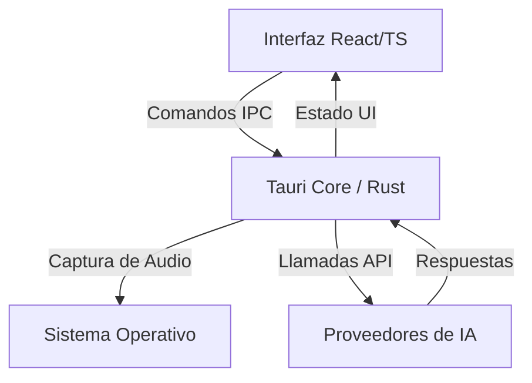

# InvisibleAI 🚀

<div align="center">
  <a href="https://invisibleai.com/">
    
  </a>
</div>

---

[](https://github.com/EDY28-M/InvisibleAI)
[](https://tauri.app/)
[](https://reactjs.org/)
[](LICENSE)

> ⚠️ **PROYECTO EN CONSTRUCCIÓN**

## 📖 Descripción General
InvisibleAI es una aplicación de escritorio multiplataforma rápida y privada para la interacción con modelos de IA. Esta herramienta te permite experimentar una asistencia en tiempo real con privacidad y control total.

## 🏗️ Arquitectura del Sistema



## 🧠 Modelos Disponibles y Configuración

El sistema es flexible y soporta múltiples proveedores de nube, así como ejecución local para mayor privacidad.

### ☁️ Modelos en la Nube
Necesitarás añadir tus propias API Keys desde los ajustes internos:
*   **OpenAI:** (GPT-4o, GPT-3.5)
*   **Anthropic:** (Claude 3.5 Sonnet, Opus)
*   **Google Gemini:** (Gemini 1.5 Pro, Flash)

### 💻 Configuración de Modelos Locales (Paso a Paso)
Si prefieres máxima privacidad (sin necesidad de internet), sigue estos pasos:
1. **Instala [Ollama](https://ollama.com/) o [LM Studio](https://lmstudio.ai/)** en tu computadora.
2. **Descarga un modelo compatible**. Los más recomendados son: `llama3`, `mistral`, `phi3` o `qwen`.
   * *Ejemplo en Ollama:* Abre tu terminal y ejecuta `ollama run llama3`.
3. **Abre InvisibleAI** y dirígete a la pestaña de "Configuración de Modelos".
4. Selecciona **Proveedor Local**.
5. Ingresa la URL base de tu servidor local (ej. `http://localhost:11434` para Ollama o `http://localhost:1234` para LM Studio).
6. Guarda los cambios. ¡Listo! Todo el procesamiento ocurrirá en tu computadora.

## 🎙️ Configuración de Audio (STT y TTS)

InvisibleAI está diseñado para escucharte y hablarte sin necesidad de tocar el teclado:
*   **Reconocimiento de Voz (STT - Speech to Text):** Puedes configurarlo para transcribir tu voz al instante usando Whisper (OpenAI), Deepgram o reconocimiento del sistema. *Nota: Deberás aceptar los permisos de micrófono del sistema operativo en el primer uso.*
*   **Texto a Voz (TTS - Text to Speech):** Permite que la IA te responda con voz fluida y natural. Puedes usar ElevenLabs, OpenAI TTS, o las voces integradas de Windows/macOS.

## 💳 Suscripción y Limitaciones
Ten en cuenta que el acceso está estructurado mediante suscripción:
*   **Cuenta Gratuita:** Funcionalidades básicas y uso limitado a modelos estándar.
*   **Cuenta Premium:** Acceso total, máxima velocidad y modelos avanzados sin límite de cuota.

## 🚀 Comandos para Levantar el Proyecto

Asegúrate de tener Node.js y Rust instalados.

```bash
# Instalar todas las dependencias
npm install

# Levantar la aplicación en modo de desarrollo
npm run tauri dev

# Compilar los ejecutables de producción
npm run tauri build
```
