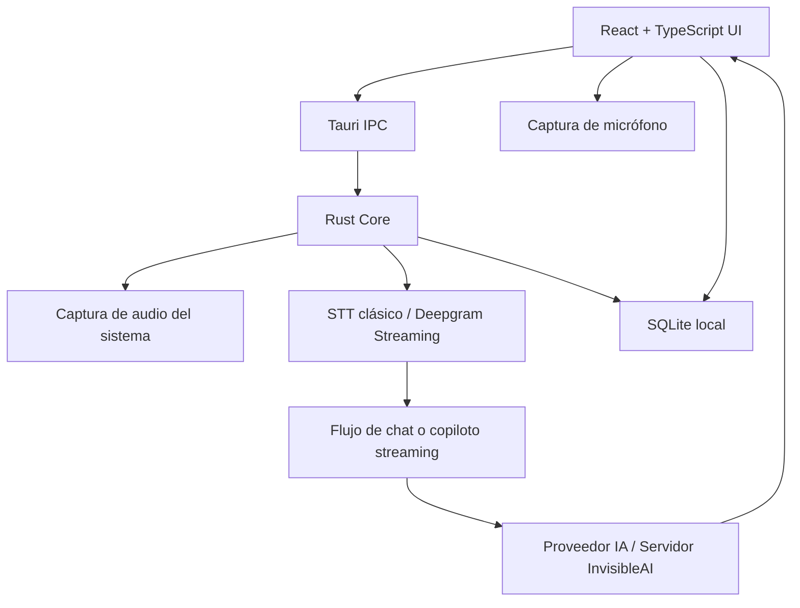

# InvisibleAI

<div align="center">
  <a href="https://invisibleai.com/">
    
  </a>
</div>

---

[](https://tauri.app/)
[](https://reactjs.org/)
[](https://www.rust-lang.org/)
[](LICENSE)
[](https://github.com/EDY28-M/invisibleai/releases)

> Proyecto en construcción. InvisibleAI es una app de escritorio multiplataforma para asistencia con IA en reuniones, entrevistas, clases, auditorías, videos y conversaciones en tiempo real.

## Descripción

InvisibleAI combina una interfaz flotante hecha en React/TypeScript con un núcleo Tauri/Rust para captura de audio, transcripción, proveedores de IA, persistencia local y publicación multiplataforma.

La aplicación permite trabajar en dos caminos separados:

- **Streaming**: captura en tiempo real con Deepgram Streaming, audio del sistema, micrófono y copiloto multicanal.
- **No-streaming**: captura clásica por segmentos, STT tradicional con proveedores como Groq Whisper, OpenAI, Deepgram clásico o proveedores personalizados.

## Novedades en v1.2.3

### Cliente API del servidor InvisibleAI (`server-api.ts`)
- Nuevo módulo centralizado para todas las llamadas HTTP al servidor propio de InvisibleAI.
- Resuelve la URL del servidor desde variable de entorno `VITE_INVISIBLEAI_SERVER`, `localStorage` o fallback a `localhost:3000`.
- Soporte para obtener configuración remota, tokens de Deepgram, completions de chat y transcripción STT desde el servidor.
- Caché de tokens de Deepgram en `deepgramTokenCacheRef` para evitar solicitudes repetidas al servidor.

### Modo servidor para streaming y STT
- El hook `useSystemAudio` ahora obtiene credenciales de Deepgram desde el servidor de InvisibleAI cuando la API está activa, en lugar de usar la API key local del usuario.
- `STREAMING_DISPATCH_IDLE_MS` reducido de 1000ms a 500ms para despacho más rápido del copiloto streaming.
- Cuando la API de InvisibleAI está habilitada, las secciones de proveedores AI y STT se bloquean con un banner informativo que indica que los servidores de InvisibleAI están gestionando la configuración.

### Proveedores bloqueados con API de InvisibleAI
- Pantalla de Dev Space (`dev/index.tsx`) muestra un banner "API de InvisibleAI activa" con candado cuando el modo servidor está habilitado.
- El banner bloquea la edición de proveedores AI y STT e incluye un botón para desactivar la API y volver a configuración manual.

### Panel de licencia y estado del sistema mejorado
- Texto del estado del sistema actualizado para usuarios en modo gratuito: indica que acceden a los servidores de InvisibleAI sin licencia.
- Colores de éxito migrados de emerald a zinc para mantener la paleta neutral.
- Badge de estado usa azul para modo gratuito activo y zinc para licencia premium.

### Eliminación total de colores de acento restantes
- Eliminados los últimos usos de emerald y amber en `ResultsSection`, `StatusIndicator`, `Warning`, `ChatAudio`, `AudioSelection` y `ScreenshotConfigs`.
- Etiquetas de transcripción interim (Tú/Sistema) ahora usan zinc en lugar de emerald/amber.
- Todos los componentes de la UI usan exclusivamente escala zinc/neutral.

### Workflow de GitHub Actions simplificado
- El workflow `publish.yml` ya no compila ejecutables multiplataforma.
- Ahora crea un release en GitHub y sube únicamente archivos `.txt` como assets.
- La compilación de Tauri (macOS ARM, macOS x86, Ubuntu, Windows) queda comentada y disponible para reactivarse.
- Se ejecuta en un solo runner `ubuntu-22.04` sin matrix de plataformas.
- La versión del release se extrae automáticamente de `package.json`.

### Bugs corregidos
- **Colores inconsistentes**: componentes que aún usaban emerald/amber para estados activos, transcripciones interim y badges — unificados a zinc.
- **Comentarios innecesarios en JSX**: eliminados comentarios vacíos `{}` y comentarios redundantes en múltiples componentes.
- **Proveedores editables con servidor activo**: antes se podían modificar API keys locales mientras el servidor de InvisibleAI gestionaba la configuración, causando conflictos. Ahora se bloquea la edición con feedback visual.

---

## Novedades en v1.2.2

### Visualizador de audio profesional
- Reemplazado el visualizador de ondas sinusoidales por barras verticales estilo Apple Voice Memos / Spotify.
- 32 barras con distribución de altura en curva bell (centro más alto), variación de velocidad y fase por barra.
- Suavizado fast-attack / slow-decay para movimiento natural sin lag visual.
- Adapta color al tema: barras blancas/claras en modo oscuro, grises oscuras en modo claro.
- Sin impacto en latencia — canvas nativo con `requestAnimationFrame`.

### Iconografía migrada a Lucide React
- `AudioLines` para modo Auto y estado activo del botón principal.
- `Layers2` para Multihilo (dos capas = dos canales).
- `Sparkles` para Modo inteligente.
- `AudioWaveform` para el trigger principal en estado inactivo.
- `Mic` para Manual.
- Familia consistente con el resto de la app, strokes uniformes.

### Paleta de colores neutral (sin chroma)
- Eliminados todos los colores de acento: amber, emerald, teal y green.
- Todos los estados activos (tabs, botón principal, dot Listening, iconos) usan escala zinc/neutral.
- Botones de acción (Start Recording, Stop & Send) en `zinc-900 / zinc-100` adaptable a modo oscuro.
- Color único de acento por toda la interfaz — sin mezcla de colores.

### Corrección de bugs en cambio de modos (Auto / Multihilo / Manual)
- **Cola bloqueada**: utterances del modo anterior quedaban con `isRecording: true` y bloqueaban el procesamiento indefinidamente. Ahora se limpia la cola antes de cada cambio.
- **Race condition**: `setIsDualChannel` disparaba el `useEffect` de streaming antes de que terminaran los invokes de Rust. Ahora `handleModeChange` es `async/await` y el estado se actualiza en el orden correcto.
- **Doble mic stream**: al hacer click rápido entre Auto y Multihilo se podían crear dos streams de micrófono simultáneos. Añadido flag `cancelled` que aborta el setup si el efecto se limpia antes de terminar.
- **Guard de clicks dobles**: los tabs se deshabilitan durante la transición de modo para evitar cambios concurrentes.

### Mejoras de audio no-streaming (heredadas de v1.2.1 y refinadas)
- Downsampling de 48kHz a 16kHz en Rust antes de codificar WAV — reduce el tamaño del payload a 1/3.
- Decode base64 directo con `atob()` en lugar de `fetch(data:url)` — transcripción del sistema igual de rápida que el micrófono.
- Flush timeout de 900ms: si no llega audio fuerte durante 900ms, el VAD envía lo que tiene sin esperar al umbral de silencio.
- Cola procesada sin bloqueo: procesa cualquier utterance lista en vez de esperar estrictamente orden cronológico.
- Etiquetas `[Sistema]:` y `[Tú]:` siempre correctas independientemente del modo (Auto/Multihilo).
- Eliminado el accumulated text duplicado que mostraba el mismo mensaje dos veces.

---

## Novedades en v1.2.1

- **Deepgram Streaming real-time** para audio del sistema en modo Auto.
- **Multihilo streaming** con audio del sistema y micrófono en paralelo.
- **Copiloto multicanal para streaming**:
  - `[Sistema]` representa audio externo: reunión, llamada, entrevista, clase, video o live.
  - `[Tú]` representa la voz del usuario por micrófono.
  - El micrófono tiene prioridad cuando el usuario habla.
  - El contexto reciente del sistema ayuda a responder preguntas del usuario.
- **Modo inteligente para streaming**:
  - Checkbox opcional visible solo con proveedores streaming.
  - Detección local de preguntas, solicitudes, objeciones, debates, opiniones fuertes, propuestas y decisiones.
  - Evita responder a ruido, fillers o contexto narrativo sin intención clara.
- **Respuestas streaming sin cierres innecesarios**:
  - No termina con frases tipo "¿quieres que profundice?" o "¿te gustaría que...?".
  - Prioriza respuestas cortas, accionables y listas para decir.
- **Captura clásica no-streaming corregida**:
  - VAD local en Rust menos agresivo para audio del sistema.
  - El audio enviado al STT se conserva crudo/normalizado, sin destruirlo con noise gate.
  - Migración de presets antiguos de VAD para evitar configuraciones guardadas demasiado restrictivas.
  - Logs temporales `ClassicSystemAudio` para diagnosticar captura, Blob WAV, STT y envío al chat.
- **UI de streaming ajustada**:
  - En streaming se muestran Auto, Multihilo y Modo inteligente.
  - Manual se mantiene para proveedores no-streaming.
  - Iconografía actualizada con `iconoir-react` en la zona de controles.

## Modos de audio

### Streaming

Disponible cuando el proveedor STT activo es Deepgram Streaming y existe una API key válida.

- **Auto**: captura audio del sistema en tiempo real y usa el copiloto streaming.
- **Multihilo**: captura audio del sistema y micrófono en paralelo.
- **Modo inteligente**: mejora la detección de eventos accionables del audio del sistema.

El System Prompt del usuario se usa como preparación de contexto, por ejemplo: entrevista técnica, auditoría, reunión comercial, asesoría o debate. Las reglas internas de separación entre `[Sistema]` y `[Tú]` no dependen del prompt editable.

### No-streaming

Disponible para proveedores STT tradicionales.

- **Auto**: captura audio del sistema, segmenta por VAD local, transcribe y envía al chat.
- **Multihilo**: mantiene el flujo actual de sistema + micrófono.
- **Manual**: mantiene el comportamiento clásico sin cambios.

Este flujo no usa el copiloto streaming ni el Modo inteligente. Su objetivo es ser simple y estable: capturar audio, transcribirlo con el proveedor elegido y enviarlo al chat.

## Proveedores soportados

### IA / LLM

Configura tus propias API keys desde ajustes:

- OpenAI
- Anthropic Claude
- Google Gemini
- Proveedores compatibles con API personalizada
- Modelos locales vía Ollama o LM Studio

### STT

- Deepgram Streaming real-time
- Deepgram clásico
- Groq Whisper
- OpenAI Whisper / STT
- Proveedores STT personalizados

### TTS

- ElevenLabs
- OpenAI TTS
- Voces integradas de Windows/macOS cuando estén disponibles

## Arquitectura



## Configuración local

Requisitos:

- Node.js LTS
- Rust estable
- Dependencias nativas de Tauri según el sistema operativo

```bash
# Instalar dependencias
npm install

# Ejecutar frontend en desarrollo
npm run dev

# Ejecutar app Tauri en desarrollo
npm run tauri dev

# Build web
npm run build

# Build instaladores de escritorio
npm run tauri build
```

## Modelos locales

Para usar IA local:

1. Instala [Ollama](https://ollama.com/) o [LM Studio](https://lmstudio.ai/).
2. Descarga un modelo compatible, por ejemplo `llama3`, `mistral`, `phi3` o `qwen`.
3. Abre InvisibleAI y configura un proveedor local.
4. Usa una URL base como `http://localhost:11434` para Ollama o `http://localhost:1234` para LM Studio.

## Release y despliegue

La versión actual es **1.2.3**.

Los archivos que deben mantenerse sincronizados para release son:

- `package.json`
- `package-lock.json`
- `src-tauri/Cargo.toml`
- `src-tauri/Cargo.lock`
- `src-tauri/tauri.conf.json`

El workflow `.github/workflows/publish.yml` crea un release en GitHub y sube archivos `.txt` como assets al hacer push a `main`. La compilación de ejecutables multiplataforma está comentada y puede reactivarse. El release usa el formato de tag:

```text
app-v<VERSION>
```

Para esta versión, GitHub Actions generará el release como:

```text
app-v1.2.3
```

## Estructura del proyecto

```text
InvisibleAI/
├── src/                    # Frontend React + TypeScript
│   ├── components/         # Componentes reutilizables
│   ├── contexts/           # Contextos globales
│   ├── hooks/              # Hooks de captura, audio y estado
│   ├── lib/                # Funciones de IA, STT, storage, copiloto y server-api
│   ├── screens/            # Pantallas principales de la app
│   └── types/              # Tipos TypeScript
├── src-tauri/              # Backend Rust + Tauri
│   ├── src/                # Comandos Rust, captura, STT, updater
│   ├── icons/              # Iconos para plataformas
│   ├── capabilities/       # Permisos Tauri
│   └── tauri.conf.json     # Configuración de Tauri
├── .github/workflows/      # GitHub Actions
├── logo/                   # Logotipos fuente
└── images/                 # Imágenes del README
```

## Licencia

Este proyecto utiliza una licencia comercial de código disponible.

- Puedes usar la versión gratuita según las condiciones del producto.
- Puedes leer y auditar el código fuente.
- Está prohibido modificar el código para saltarse licencias, redistribuir cracks o publicar clones que desbloqueen funciones premium.

Lee los términos completos en [LICENSE](LICENSE).
