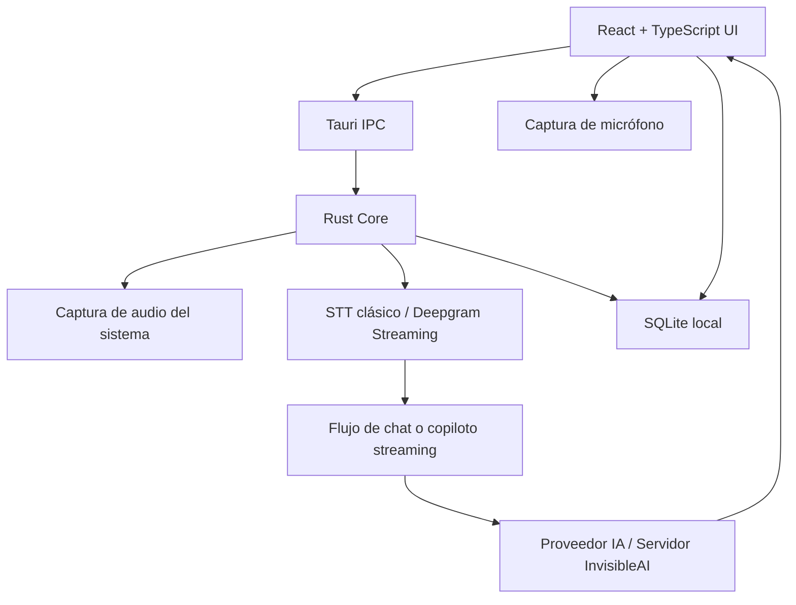

# InvisibleAI

<div align="center">
  <a href="https://invisibleai.com/">
    
  </a>
</div>

---

[](https://tauri.app/)
[](https://reactjs.org/)
[](https://www.rust-lang.org/)
[](LICENSE)
[](https://github.com/EDY28-M/invisibleai/releases)

> Proyecto en construcción. InvisibleAI es una app de escritorio multiplataforma para asistencia con IA en reuniones, entrevistas, clases, auditorías, videos y conversaciones en tiempo real.

## Descripción

InvisibleAI combina una interfaz flotante hecha en React/TypeScript con un núcleo Tauri/Rust para captura de audio, transcripción, proveedores de IA, persistencia local y publicación multiplataforma.

La aplicación permite trabajar en dos caminos separados:

- **Streaming**: captura en tiempo real con Deepgram Streaming, audio del sistema, micrófono y copiloto multicanal.
- **No-streaming**: captura clásica por segmentos, STT tradicional con proveedores como Groq Whisper, OpenAI, Deepgram clásico o proveedores personalizados.

## Novedades en v1.5.2

### Llama 4 Scout para usuarios free

Los usuarios sin licencia ahora usan **`meta-llama/llama-4-scout-17b-16e-instruct`** como modelo principal del servidor, reemplazando a `llama-3.3-70b-versatile`. Llama 4 Scout incluye soporte de visión nativa, lo que habilita el análisis de imágenes y capturas de pantalla para el tier gratuito. La cadena de fallback es `scout → llama-3.3-70b → llama-3.1-8b` para modelos sin visión; cuando el mensaje contiene imágenes, el fallback se limita a modelos de visión (`scout` y `maverick`).

### Imágenes y capturas desbloqueadas para usuarios free

- El botón de adjuntar imagen y el botón de captura de pantalla ahora son **visibles y funcionales** para usuarios sin licencia.
- `supportsImages` en `app.context.tsx` ya no requiere `hasActiveLicense`: si el usuario no tiene clave de API local, el servidor usa scout (visión) → `supportsImages = true` automáticamente.
- En `speech/index.tsx`, el botón Screenshot ya no está protegido por `hasActiveLicense` — el gate de modo Selección (arrastrar área) sigue siendo premium en el handler.

### Capturas de pantalla 7× más rápidas

Las capturas se codifican ahora como **JPEG calidad 82** en lugar de PNG sin comprimir:

- Nuevo helper `encode_capture_base64()` en `capture.rs` — redimensiona a máx 1600 px de ancho si supera ese límite y codifica como JPEG RGB8.
- Tamaño: ~3 MB PNG → **~150–300 KB JPEG**.
- Tiempo de subida: ~5 s → **~0,7 s**.
- Aplica tanto a `capture_to_base64` (botón de cámara) como a `capture_selected_area` (modo recorte).

### Límite diario free ampliado a 150 000 tokens

`chatTokensPerDay` del tier free aumentado de 50 000 → **150 000 tokens/día** en `usage.ts` del servidor. El ciclo de reset sigue siendo de 24 h sin cambios.

### STT Deepgram: despacho a los 500 ms de silencio

`endpointing` cambiado de `10` → **`500`** en `deepgram_stream.rs`:

- Con `endpointing=10` Deepgram disparaba `speech_final` en micro-pausas entre palabras, resultando en disparos poco fiables que siempre caían al fallback `UtteranceEnd` de 1 000 ms.
- Con `endpointing=500` el fin de habla se detecta tras 500 ms reales de silencio → **chat se despacha en ~500 ms** (antes ~1 000 ms).
- `utterance_end_ms` se mantiene en 1 000 (mínimo de Deepgram) como red de seguridad.
- Solo afecta a usuarios con **licencia** (STT streaming Deepgram); los free usan Whisper batch, sin cambios.

### Corrección: chat free no respondía con mensajes largos

La cadena de fallback de modelos Groq fallaba silenciosamente cuando el prompt llegaba a `llama-3.1-8b-instant` (límite 6 000 TPM), que devolvía error 413 "request too large":

- `isRateLimitError` renombrado a `isRetryableModelError` — ahora captura también errores 413 y mensajes "request too large".
- Orden de fallback reordenado a `scout (30k TPM) → 70b (12k TPM) → 8b (6k TPM)` — el modelo más capaz va primero.
- Se añadió el Set `GROQ_VISION_MODELS` y la función `messagesHaveImages()` para filtrar fallbacks a solo modelos con visión cuando el mensaje incluye imágenes.

### Endpoint de reset de uso (admin)

Nuevo endpoint `POST /api/admin/usage/reset` en el servidor:

- Sin body → resetea **todos** los registros de `usageBalance`.
- Con `{ "instanceId": "…" }` → resetea solo ese dispositivo.
- Script reutilizable en `scripts/reset-free-limits.mjs`: `node reset-free-limits.mjs` (todos) o `node reset-free-limits.mjs <instanceId>` (uno).

### Nginx: soporte de imágenes grandes

`client_max_body_size 25M;` añadido al bloque server del VPS. Antes las capturas (~2–3 MB en base64) eran rechazadas con error 413 por el límite por defecto de 1 MB.

---

## Novedades en v1.5.1

### Límites del servidor ampliados

Se duplicaron (o más) todos los umbrales del tier licensed en el servidor de producción:

- **Chat IA licensed**: 300 000 → **700 000 tokens** por período, con reset cada **12 horas** (antes era cada 24 h). El sistema divide el día en dos bloques UTC: AM (00:00–12:00) y PM (12:00–24:00); cada bloque tiene su cuota propia.
- **Créditos de streaming Deepgram**: recarga diaria 1 800 → **20 000 créditos/día**. Máximo acumulable 14 400 → **40 000**. Bono de bienvenida en licencia nueva: 3 600 créditos adicionales al primer día (total día 1: **23 600**).
- **Tier free sin cambios**: sigue en 50 000 tokens/día y 15 llamadas Whisper/día.

### Corrección de fuga de créditos de streaming

Los créditos de Deepgram se descontaban de forma continua aunque el usuario no estuviese hablando ni capturando audio. La raíz era que el reportero periódico facturaba tiempo de pared sin verificar si había llegado audio real.

- `reportStreamingUsageSinceLastTick` en `useSystemAudio.ts` y `AutoSpeechVad.tsx` ahora solo factura hasta `min(ahora, últimoAudio + 5 s)`. Si no llegó audio desde el último tick, la facturación es cero.
- `streamingUsageLastReportAtRef` avanza siempre a `now` para evitar acumulación diferida de silencio en el siguiente tick.
- El timer de 10 segundos sigue activo mientras la sesión está abierta, pero los ticks sin actividad de audio resultan en 0 segundos facturados al servidor.

### Corrección de idioma de respuesta

Al configurar un idioma de respuesta en ajustes, la IA seguía contestando en otro idioma ignorando la selección. Corregido: el idioma seleccionado ahora se aplica correctamente al system prompt en todas las rutas de procesamiento (chat completion y flujo de audio), garantizando que el modelo responda en el idioma configurado desde el primer mensaje.

### Reset de 12 horas para chat licensed

El contador de tokens del chat licensed ahora usa períodos de 12 horas en lugar de días completos. Implementado con claves de período `YYYY-MM-DDA` / `YYYY-MM-DDB` que cambian a las 12:00 UTC. `resetsAt` en el balance devuelve la hora exacta del próximo reset (12:00 o 00:00 UTC del día).

---

## Novedades en v1.5.0

### Conexión directa al servidor para usuarios free (chat y STT)

Se rediseñó el camino de chat y transcripción del tier gratuito para eliminar la indirección por Rust que estaba fallando en silencio:

- **Chat free**: el frontend hace `POST` directo a `${VITE_INVISIBLEAI_SERVER}/api/chat` con `model: "llama-3.3-70b-versatile"` y `stream: true`. Se eliminó la dependencia del comando Tauri `chat_stream_response` que dependía de los eventos `chat_stream_chunk` / `chat_stream_complete` y dejaba el popover del chat vacío cuando algo fallaba en el backend.
- **STT free**: `fetchInvisibleAISTT` ahora delega en `serverApi.transcribe()`, que envía multipart al endpoint `/api/stt` del servidor. El servidor decide el modelo: `whisper-large-v3` (no-turbo) para free, `whisper-large-v3-turbo` para licencia activa. La validación bloqueante `ensureLicensedCredentialsValid()` se removió tanto del chat como del STT — los créditos y límites se aplican del lado del servidor en `/api/chat` y `/api/stt`.
- **Chat licensed**: los usuarios con `groq_api_key` cacheado localmente siguen llamando a Groq directo (mínima latencia). Se eliminó también el gate `ensureLicensedCredentialsValid()` upfront.
- **Parser SSE unificado**: se extrajo `readSSEStream` que consume tanto el formato de Groq (`choices[0].delta.content`) como el del servidor InvisibleAI. Los errores se `throw` correctamente en lugar de tragarse como texto — la UI ahora setea `state.error` y el popover se mantiene abierto mostrando el mensaje real, en vez de cerrarse sin feedback.

### Bloqueo de perfiles para usuarios free

Pantalla `/profiles` rediseñada para el tier gratuito:

- Banner ámbar arriba con icono de candado y mensaje "Los perfiles requieren una licencia activa".
- Las cards de plantillas siguen **visibles** (información completa) pero con `cursor-not-allowed`, `opacity-60`, `aria-disabled`, sin animación hover, y `onClick` que retorna en seco.
- Badge "Requiere licencia" en el header de la sección de plantillas.
- El botón "Desactivar Perfil" del `rightSlot` se oculta para usuarios free (salvo excepción del perfil de entrevistas — ver siguiente apartado).
- La sección de Modificadores + Notas queda oculta para free (para no dejar UI inconsistente con perfiles arrastrados de un estado licensed previo).

### Plantilla "Experto en Entrevistas y Reuniones" (nueva)

Nueva plantilla seed en la migración v7 (`profile-interview-expert.sql`) priorizada al primer lugar de la grilla por la migración v8 (`profile-interview-priority.sql`):

- **`interview_meeting_expert`** — coach senior de carrera y comunicación profesional. Detecta automáticamente contexto de entrevista a partir de frases gatillo en español e inglés (*"cuéntame de ti"*, *"¿cuál es tu experiencia?"*, *"¿has trabajado en X antes?"*, *"cuéntame a detalle"*, *"¿pretensiones salariales?"*, *"tell me about yourself"*, *"walk me through your resume"*, *"why are you leaving"*…). Responde en primera persona usando el CV del usuario, con estructura STAR/SAR para preguntas conductuales, clarificar → estimar → diseñar → trade-offs para system design, y Bottom Line Up Front para reuniones ejecutivas. Incluye reglas de negociación salarial, manejo de preguntas difíciles y lo que nunca debe hacer (no inventar empresas/fechas/cifras, no descalificar empleadores anteriores, no usar jerga vacía).
- **8 modificadores propios** (con `template_id` no-NULL, solo aparecen en este perfil): Técnica, Conductual/STAR, System Design, Reunión de Ventas, Reunión Ejecutiva, Negociación Salarial, Entrevista en Inglés, Panel Interview.

### Carga local de CV con extracción de texto (PDF / DOCX / TXT / MD)

Nueva tarjeta `CvUploadCard` que aparece cuando el perfil de entrevistas está activo:

- **Parser local en el browser** (`lib/functions/cv-parser.function.ts`):
  - `.txt / .md / .markdown / .rtf` → `FileReader.text()` directo.
  - `.pdf` → `pdfjs-dist@4.10.38` build **legacy** con `disableStream: true`, `disableAutoFetch: true`, `isEvalSupported: false`. Se eligió la línea v4 porque la v6 usa `for await (const … of readableStream)` que no está soportado por JavaScriptCore en macOS Tauri ni por WebKitGTK en Linux (error `undefined is not a function (near '…value of readableStream…')`).
  - `.docx` → `mammoth/mammoth.browser` (`extractRawText`).
- **Dynamic imports** + `optimizeDeps.exclude: ["pdfjs-dist", "mammoth"]` en `vite.config.ts` para que ambos paquetes salgan como chunks lazy y Vite no los pre-bundee (evita mismatches API/Worker tras upgrades/downgrades).
- **Almacenamiento local-only**: el texto se trim-ea y se persiste en `localStorage` con cap a `CV_MAX_CHARS = 32 000` para no reventar el context window. El CV **nunca sale del dispositivo**.
- **Inyección en el system prompt**: `augmentWithInterviewContext()` lee el perfil activo vía `invoke("get_active_profile")` y, solo si es `interview_meeting_expert`, añade al system prompt un bloque `<CV>…</CV>` más un recordatorio operativo. Wired tanto en `useCompletion.buildEnrichedSystemPrompt` como en el flujo de audio (`useSystemAudio`). Cero impacto para los demás perfiles.
- **Funciona con `llama-3.3-70b-versatile`** porque el archivo se procesa localmente y al modelo solo le llega texto plano — no requiere modelo multimodal.

### Una prueba gratuita del perfil de entrevistas para usuarios free

Excepción controlada al bloqueo de perfiles, persistida en `localStorage` (`iai_interview_trial_used`):

- Usuario free con trial **no usado** → la card del Experto en Entrevistas aparece con badge verde `1×` y borde resaltado; el resto siguen bloqueadas.
- Al activarla por primera vez se llama `consumeTrial()` y el flag queda en `true` para siempre.
- Durante la prueba activa, el usuario tiene acceso completo: modificadores, notas, CV upload, chat con CV inyectado.
- Si desactiva el perfil tras agotar la prueba → ya no puede re-activarlo. La regla `canSelectTemplate()` solo permite re-clicks sobre la card del perfil actualmente activo.
- Activar una licencia desbloquea todo automáticamente (`hasActiveLicense` cortocircuita la lógica del trial).

### Refinamiento de Perfiles Modulares e Interacciones de Deselección (Toggle)

Se mejoró la experiencia de usuario y la consistencia de la configuración del sistema de prompts y perfiles:

- **Alternancia y Deselección en Prompts (Toggle)**:
  - **Presets y Personalizados**: Habilitada la funcionalidad para deseleccionar prompts tanto predeterminados como creados por el usuario en la pantalla de System Prompts. Al hacer clic sobre un prompt que ya está seleccionado, se desactivará, limpiando las llaves en localStorage (`selected_system_prompt_id`, `selected_invisibleai_prompt`) y restableciendo el prompt global de la IA al valor predeterminado del sistema (`DEFAULT_SYSTEM_PROMPT`).
- **Deselección de Perfiles Modulares**:
  - En la pantalla `/profiles`, hacer clic sobre la tarjeta de un perfil modular activo ahora lo desactiva. Esta acción se sincroniza en caliente con SQLite estableciendo el `template_id` a `NULL` y limpiando la lista de modificadores en la tabla `active_profile_config`, provocando un fallback inmediato al perfil general de la aplicación.
- **Resolución de Errores en Compilación Rust**:
  - Se solventó el error de propiedad (`E0382: use of moved value`) en el constructor de contexto (`context_builder.rs`), clonando de forma segura la variable de entorno `app_data_dir` antes de la obtención de la línea de tiempo de la sesión para evitar bloqueos y fallos del compilador.
- **Validación Completa sin Errores**:
  - Verificación del tipado TypeScript exitosa con `tsc --noEmit` y empaquetado de producción exitoso con `pnpm run build` sin advertencias críticas en el bundle principal.

## Novedades en v1.4.0

### Motor de IA nativo en Rust (backend)

Se implementó un motor de IA completo directamente en el backend Rust de Tauri, sin depender del frontend para orquestar las llamadas al modelo.

**Servicios nuevos en `src-tauri/src/services/`:**

- **`cognitive_router.rs`** — Router cognitivo que clasifica cada evento de audio (`ExternalQuestion`, `ExternalObjection`, `ExternalRequest`, `ExternalProposal`, `ExternalDecision`, `ExternalDebateClaim`, `ExternalOpinion`, `ExternalContext`, `ExternalNoise`) y decide la estrategia de respuesta según el tipo de evento y el perfil activo. Orquesta las llamadas al LLM con streaming y emite los chunks vía eventos Tauri.
- **`context_builder.rs`** — Constructor de contexto que ensambla el prompt para el modelo combinando el perfil activo, el historial de la sesión, los segmentos de transcripción relevantes y los resúmenes de contexto previos.
- **`intent_classifier.rs`** — Clasificador local de intenciones que determina si el contenido de audio merece procesar o ignorar antes de invocar el modelo.
- **`memory_service.rs`** — Servicio de memoria persistente con filtrado de ruido integrado: descarta fragmentos cortos o irrelevantes ("hola", "ok", "de acuerdo") y almacena solo información semánticamente útil en SQLite.
- **`session_service.rs`** — Servicio de sesiones en vivo con soporte para `LiveSession`, `TranscriptSegment` (transcripción por segmentos con timestamps, speaker label, confianza y secuencia), y `SessionContextSummary` (resúmenes periódicos de contexto para no saturar el historial).
- **`profile_service.rs`** — Servicio de perfiles que carga `ProfileTemplate` y `ProfileModifier` desde SQLite y compila el perfil activo (`CompiledProfile`) para inyectarlo al `context_builder`.

**Migraciones de base de datos:**

- `memory-schema.sql` — Esquema para hechos de memoria global y memoria por sesión.
- `session-schema.sql` — Esquema para sesiones en vivo, segmentos de transcripción y resúmenes de contexto.
- `profile-templates.sql` — Plantillas y modificadores de perfiles de IA con categorías y sort order.

### Sistema de Perfiles de IA

Nueva pantalla de gestión de perfiles (`screens/profiles/index.tsx`) y hook `useProfiles.ts` que permiten configurar el comportamiento del modelo por contexto de uso:

- Plantillas base con rol, personalidad e instrucciones propias.
- Modificadores apilables por categoría (ej. "Desarrollador Senior", "Modo entrevista", "Lenguaje formal").
- Campo de notas personalizadas sobre la plantilla elegida.
- El perfil compilado se inyecta en cada llamada al LLM como parte del system prompt enriquecido.

### Modo multihilo — Comportamiento del AI corregido

En modo Multihilo (dual-channel, VAD clásico no-streaming), el AI ahora opera como copiloto pasivo hasta que hay contenido accionable:

- **`[Tú]:`** ya no dispara respuesta. Las palabras del candidato se guardan en el historial como contexto pero no invocan al modelo.
- **`isActionableSystemAudio()`** — nuevo gate de accionabilidad para mensajes del sistema: solo responde cuando detecta pregunta (`?`) o frases directivas en español e inglés. Fragmentos no-accionables se acumulan silenciosamente hasta que llega una pregunta real, momento en el que el modelo recibe el contexto acumulado completo.
- El historial de la conversación ahora incluye ambos canales en orden cronológico, dando al modelo visibilidad completa de lo hablado desde el inicio.
- Nota de doble canal activa en todos los modos (no solo no-streaming).

### Captura de pantalla en macOS 26 corregida

`CGWindowListCreateImage` (CoreGraphics legacy) fue degradada por Apple en macOS 26 — devolvía solo el wallpaper aunque la app tuviera permiso de Screen Recording. Se reemplazó por `/usr/sbin/screencapture` (usa ScreenCaptureKit internamente) tanto para el botón de cámara (`capture_to_base64`) como para el modo recorte con licencia (`start_screen_capture`). Windows y Linux no cambian. La protección de contenido (modo sigilo) continúa funcionando de forma nativa.

### Screenshot en modo streaming

El botón de cámara ahora funciona de forma activa en modo streaming:

- Al hacer click, captura la pantalla, comprime la imagen y llama a `processWithAI` inmediatamente, sin esperar al siguiente evento de audio.
- Si había texto acumulado del entrevistador, se usa como contexto adicional junto con la imagen.
- `processWithAI` acepta `screenshotOverride` que bypasea el guard `isSystemStreamingMessage` — la imagen llega al modelo aunque el canal sea del sistema.
- Se añade instrucción explícita al system prompt para que el modelo priorice el análisis visual sobre el persona prompt cuando hay screenshot activo.

### Pantalla de administración de memoria

Nueva pantalla `screens/memory-admin/index.tsx` que permite ver, buscar y administrar los hechos de memoria almacenados por la app. Integra con el `memory_service` del backend para mostrar qué recuerda el modelo entre sesiones.

### Botón de captura disponible en todos los planes

Removido el requisito de licencia activa (`hasActiveLicense`) del botón Screenshot. La captura de pantalla está disponible para usuarios gratuitos y con licencia por igual.

### Optimizaciones y limpieza (v1.4.0 base)

- Eliminadas dependencias no utilizadas (`package-lock.json`, `chart.tsx`, `ui/index.ts`).
- `CustomCursor` y `Markdown` simplificados.
- `DashboardLayout` limpiado de refs sin uso.
- `deepgram-stream.ts` depurado.
- `vite.config.ts` optimizado.
- `useCompletion.ts` sin imports muertos.
- `skipFormatting` en `buildEnhancedSystemPrompt`: el modo audio no añade instrucciones de markdown al system prompt, produciendo respuestas de chat más naturales sin bloques de código ni símbolos LaTeX innecesarios.

---

## Novedades en v1.3.0

### Sistema de Auto-Actualización (In-App)
- **Actualizaciones Silenciosas:** La aplicación ahora descarga e instala actualizaciones directamente desde la interfaz sin necesidad de navegadores externos.
- **Componente `<Updater/>`:** Interfaz integrada con barra de progreso que gestiona la descarga, instalación y reinicio automático de la app.
- **Backend de Releases:** Nuevas rutas en el servidor (`/api/update` y `/api/admin/releases`) que comparan versiones semánticas (semver) y proveen los enlaces de descarga directa.
- **Soporte Multiplataforma:** Gestión de descargas (`.tar.gz`, `.nsis.zip`) por arquitectura (macOS ARM/Intel, Windows x64) integrables con servicios de almacenamiento como Cloudflare R2.

### Seguridad y Criptografía (Hardening)
- **Encriptación de API Keys (AES-256-GCM):** Todas las claves de proveedores (Groq, Deepgram, OpenAI) se guardan cifradas en la base de datos local y se descifran en memoria solo durante su uso.
- **Hashing de Contraseñas (Bcrypt):** Eliminación de credenciales hardcodeadas. Autenticación de administrador ahora utiliza `bcrypt` con variables de entorno para una mayor seguridad.
- **Rate Limiting Granular:** Implementación de límites de peticiones globales (200/min) y por ruta específica (ej. login: 5/min, chat: 60/min, validación: 120/min) para prevenir abusos.
- **Protección de Headers HTTP (`@fastify/helmet`):** Añadidas políticas de seguridad CSP, HSTS y control de referrers en todos los endpoints públicos.
- **Admin Guard Unificado:** Función centralizada `requireAdmin()` utilizando `timingSafeEqual` para prevenir ataques de timing en todas las rutas privadas.

### Arquitectura, Rendimiento y Mantenibilidad
- **Autenticación Dual:** La función `extractDeviceAuth()` ahora extrae `instanceId` y `licenseKey` tanto desde Headers (para Fetch nativo) como desde Query Params (para WebSockets y casos especiales).
- **Caché de Licencias Optimizado:** `validateLicenseCached()` almacena en caché la validez de las licencias por 30 segundos, reduciendo la carga en la DB. Incluye mecanismos de invalidación al desactivar o eliminar un usuario.
- **Fallback Inteligente de Proveedores (`provider-keys.ts`):** Nuevo servicio que prioriza las claves cifradas administradas en el panel (DB), con caída (fallback) segura a Variables de Entorno en Render.
- **Timeout en Streams:** Establecido un límite estricto de 120s en `chat.ts` para evitar conexiones zombie.
- **Resolución de IP Confiable:** Configurado `trustProxy: true` para identificar correctamente a los usuarios a través del load balancer de Render.

### Corrección de Bugs Críticos
- **Error 401 en STT/Deepgram/Groq:** Solucionado el fallo de autorización originado al enviar versiones cifradas de las llaves. Ahora el servidor verifica, descifra correctamente y hace fallbacks a variables de entorno sin enmascaramiento falso.
- **Reset de Uso de Licencia (Upgrade):** Corregido un bug en el que pasar de estado Free a Licensed no limpiaba las cuotas de tokens previas. Ahora otorga instantáneamente un *welcome bonus* (+3,600) y recarga base (+1,800) sumando 5,400 créditos de streaming disponibles al instante.

---

## Novedades en v1.2.3

### Cliente API del servidor InvisibleAI (`server-api.ts`)
- Nuevo módulo centralizado para todas las llamadas HTTP al servidor propio de InvisibleAI.
- Resuelve la URL del servidor desde variable de entorno `VITE_INVISIBLEAI_SERVER`, `localStorage` o fallback a `localhost:3000`.
- Soporte para obtener configuración remota, tokens de Deepgram, completions de chat y transcripción STT desde el servidor.
- Caché de tokens de Deepgram en `deepgramTokenCacheRef` para evitar solicitudes repetidas al servidor.

### Modo servidor para streaming y STT
- El hook `useSystemAudio` ahora obtiene credenciales de Deepgram desde el servidor de InvisibleAI cuando la API está activa, en lugar de usar la API key local del usuario.
- `STREAMING_DISPATCH_IDLE_MS` reducido de 1000ms a 500ms para despacho más rápido del copiloto streaming.
- Cuando la API de InvisibleAI está habilitada, las secciones de proveedores AI y STT se bloquean con un banner informativo que indica que los servidores de InvisibleAI están gestionando la configuración.

### Proveedores bloqueados con API de InvisibleAI
- Pantalla de Dev Space (`dev/index.tsx`) muestra un banner "API de InvisibleAI activa" con candado cuando el modo servidor está habilitado.
- El banner bloquea la edición de proveedores AI y STT e incluye un botón para desactivar la API y volver a configuración manual.

### Panel de licencia y estado del sistema mejorado
- Texto del estado del sistema actualizado para usuarios en modo gratuito: indica que acceden a los servidores de InvisibleAI sin licencia.
- Colores de éxito migrados de emerald a zinc para mantener la paleta neutral.
- Badge de estado usa azul para modo gratuito activo y zinc para licencia premium.

### Eliminación total de colores de acento restantes
- Eliminados los últimos usos de emerald y amber en `ResultsSection`, `StatusIndicator`, `Warning`, `ChatAudio`, `AudioSelection` y `ScreenshotConfigs`.
- Etiquetas de transcripción interim (Tú/Sistema) ahora usan zinc en lugar de emerald/amber.
- Todos los componentes de la UI usan exclusivamente escala zinc/neutral.

### Workflow de GitHub Actions simplificado
- El workflow `publish.yml` ya no compila ejecutables multiplataforma.
- Ahora crea un release en GitHub y sube únicamente archivos `.txt` como assets.
- La compilación de Tauri (macOS ARM, macOS x86, Ubuntu, Windows) queda comentada y disponible para reactivarse.
- Se ejecuta en un solo runner `ubuntu-22.04` sin matrix de plataformas.
- La versión del release se extrae automáticamente de `package.json`.

### Bugs corregidos
- **Colores inconsistentes**: componentes que aún usaban emerald/amber para estados activos, transcripciones interim y badges — unificados a zinc.
- **Comentarios innecesarios en JSX**: eliminados comentarios vacíos `{}` y comentarios redundantes en múltiples componentes.
- **Proveedores editables con servidor activo**: antes se podían modificar API keys locales mientras el servidor de InvisibleAI gestionaba la configuración, causando conflictos. Ahora se bloquea la edición con feedback visual.

---

## Novedades en v1.2.2

### Visualizador de audio profesional
- Reemplazado el visualizador de ondas sinusoidales por barras verticales estilo Apple Voice Memos / Spotify.
- 32 barras con distribución de altura en curva bell (centro más alto), variación de velocidad y fase por barra.
- Suavizado fast-attack / slow-decay para movimiento natural sin lag visual.
- Adapta color al tema: barras blancas/claras en modo oscuro, grises oscuras en modo claro.
- Sin impacto en latencia — canvas nativo con `requestAnimationFrame`.

### Iconografía migrada a Lucide React
- `AudioLines` para modo Auto y estado activo del botón principal.
- `Layers2` para Multihilo (dos capas = dos canales).
- `Sparkles` para Modo inteligente.
- `AudioWaveform` para el trigger principal en estado inactivo.
- `Mic` para Manual.
- Familia consistente con el resto de la app, strokes uniformes.

### Paleta de colores neutral (sin chroma)
- Eliminados todos los colores de acento: amber, emerald, teal y green.
- Todos los estados activos (tabs, botón principal, dot Listening, iconos) usan escala zinc/neutral.
- Botones de acción (Start Recording, Stop & Send) en `zinc-900 / zinc-100` adaptable a modo oscuro.
- Color único de acento por toda la interfaz — sin mezcla de colores.

### Corrección de bugs en cambio de modos (Auto / Multihilo / Manual)
- **Cola bloqueada**: utterances del modo anterior quedaban con `isRecording: true` y bloqueaban el procesamiento indefinidamente. Ahora se limpia la cola antes de cada cambio.
- **Race condition**: `setIsDualChannel` disparaba el `useEffect` de streaming antes de que terminaran los invokes de Rust. Ahora `handleModeChange` es `async/await` y el estado se actualiza en el orden correcto.
- **Doble mic stream**: al hacer click rápido entre Auto y Multihilo se podían crear dos streams de micrófono simultáneos. Añadido flag `cancelled` que aborta el setup si el efecto se limpia antes de terminar.
- **Guard de clicks dobles**: los tabs se deshabilitan durante la transición de modo para evitar cambios concurrentes.

### Mejoras de audio no-streaming (heredadas de v1.2.1 y refinadas)
- Downsampling de 48kHz a 16kHz en Rust antes de codificar WAV — reduce el tamaño del payload a 1/3.
- Decode base64 directo con `atob()` en lugar de `fetch(data:url)` — transcripción del sistema igual de rápida que el micrófono.
- Flush timeout de 900ms: si no llega audio fuerte durante 900ms, el VAD envía lo que tiene sin esperar al umbral de silencio.
- Cola procesada sin bloqueo: procesa cualquier utterance lista en vez de esperar estrictamente orden cronológico.
- Etiquetas `[Sistema]:` y `[Tú]:` siempre correctas independientemente del modo (Auto/Multihilo).
- Eliminado el accumulated text duplicado que mostraba el mismo mensaje dos veces.

---

## Novedades en v1.2.1

- **Deepgram Streaming real-time** para audio del sistema en modo Auto.
- **Multihilo streaming** con audio del sistema y micrófono en paralelo.
- **Copiloto multicanal para streaming**:
  - `[Sistema]` representa audio externo: reunión, llamada, entrevista, clase, video o live.
  - `[Tú]` representa la voz del usuario por micrófono.
  - El micrófono tiene prioridad cuando el usuario habla.
  - El contexto reciente del sistema ayuda a responder preguntas del usuario.
- **Modo inteligente para streaming**:
  - Checkbox opcional visible solo con proveedores streaming.
  - Detección local de preguntas, solicitudes, objeciones, debates, opiniones fuertes, propuestas y decisiones.
  - Evita responder a ruido, fillers o contexto narrativo sin intención clara.
- **Respuestas streaming sin cierres innecesarios**:
  - No termina con frases tipo "¿quieres que profundice?" o "¿te gustaría que...?".
  - Prioriza respuestas cortas, accionables y listas para decir.
- **Captura clásica no-streaming corregida**:
  - VAD local en Rust menos agresivo para audio del sistema.
  - El audio enviado al STT se conserva crudo/normalizado, sin destruirlo con noise gate.
  - Migración de presets antiguos de VAD para evitar configuraciones guardadas demasiado restrictivas.
  - Logs temporales `ClassicSystemAudio` para diagnosticar captura, Blob WAV, STT y envío al chat.
- **UI de streaming ajustada**:
  - En streaming se muestran Auto, Multihilo y Modo inteligente.
  - Manual se mantiene para proveedores no-streaming.
  - Iconografía actualizada con `iconoir-react` en la zona de controles.

## Modos de audio

### Streaming

Disponible cuando el proveedor STT activo es Deepgram Streaming y existe una API key válida.

- **Auto**: captura audio del sistema en tiempo real y usa el copiloto streaming.
- **Multihilo**: captura audio del sistema y micrófono en paralelo.
- **Modo inteligente**: mejora la detección de eventos accionables del audio del sistema.

El System Prompt del usuario se usa como preparación de contexto, por ejemplo: entrevista técnica, auditoría, reunión comercial, asesoría o debate. Las reglas internas de separación entre `[Sistema]` y `[Tú]` no dependen del prompt editable.

### No-streaming

Disponible para proveedores STT tradicionales.

- **Auto**: captura audio del sistema, segmenta por VAD local, transcribe y envía al chat.
- **Multihilo**: mantiene el flujo actual de sistema + micrófono.
- **Manual**: mantiene el comportamiento clásico sin cambios.

Este flujo no usa el copiloto streaming ni el Modo inteligente. Su objetivo es ser simple y estable: capturar audio, transcribirlo con el proveedor elegido y enviarlo al chat.

## Funcionamiento del Micrófono e IA (Manual de Usuario)

Para garantizar una experiencia fluida y evitar respuestas no deseadas, la aplicación maneja el micrófono y el procesamiento del modelo de IA bajo ciertas reglas de control de concurrencia y filtrado:

### 1. Palabras Clave de Activación (Trigger Words)
Cuando hablas por el micrófono (`[Tú]`), tu voz siempre se transcribe y se añade a la línea de tiempo cronológica para servir como contexto de la conversación. Sin embargo, **la IA solo se activará y responderá directamente a tu voz si inicias o incluyes alguna de las siguientes palabras clave** al hablar:
- `invisible`
- `asistente`
- `sugiere`
- `oye`
- `corrige`
- `ayuda`
- `dime`

*Ejemplo de uso:* *"Oye, ¿cuál sería la mejor alternativa para esta arquitectura?"* o *"Invisible, ayuda a refactorizar este método"*. Si hablas sin emplear estas palabras clave, tu intervención se guardará en el historial de manera silenciosa para enriquecer el contexto del copiloto sin interrumpirte.

### 2. Control de Concurrencia (Turnos y Cancelación)
La aplicación procesa las respuestas del modelo de forma secuencial (toma de turnos) en lugar de múltiples flujos desordenados en paralelo:
- **Interrupción Inteligente**: Si la IA está generando texto en tiempo real y decides hablar usando una palabra clave (por ejemplo: *"oye, detente y cambia el enfoque"*), la aplicación aborta inmediatamente la tarea de streaming en curso e inicia la nueva respuesta en el acto.
- **Captura Concurrente**: La transcripción de tu voz (Micrófono) y las voces de terceros (Audio del Sistema) se procesan de manera simultánea en segundo plano. Esto asegura que la línea de tiempo mantenga un registro cronológico fiel de toda la reunión.

## Proveedores soportados

### IA / LLM

Configura tus propias API keys desde ajustes:

- OpenAI
- Anthropic Claude
- Google Gemini
- Proveedores compatibles con API personalizada
- Modelos locales vía Ollama o LM Studio

### STT

- Deepgram Streaming real-time
- Deepgram clásico
- Groq Whisper
- OpenAI Whisper / STT
- Proveedores STT personalizados

### TTS

- ElevenLabs
- OpenAI TTS
- Voces integradas de Windows/macOS cuando estén disponibles

## Arquitectura



## Configuración local

Requisitos:

- Node.js LTS
- Rust estable
- Dependencias nativas de Tauri según el sistema operativo

```bash
# Instalar dependencias
npm install

# Ejecutar frontend en desarrollo
npm run dev

# Ejecutar app Tauri en desarrollo
npm run tauri dev

# Build web
npm run build

# Build instaladores de escritorio
npm run tauri build
```

## Modelos locales

Para usar IA local:

1. Instala [Ollama](https://ollama.com/) o [LM Studio](https://lmstudio.ai/).
2. Descarga un modelo compatible, por ejemplo `llama3`, `mistral`, `phi3` o `qwen`.
3. Abre InvisibleAI y configura un proveedor local.
4. Usa una URL base como `http://localhost:11434` para Ollama o `http://localhost:1234` para LM Studio.

## Release y despliegue

La versión actual es **1.5.2**.

Los archivos que deben mantenerse sincronizados para release son:

- `package.json`
- `package-lock.json`
- `src-tauri/Cargo.toml`
- `src-tauri/Cargo.lock`
- `src-tauri/tauri.conf.json`

El workflow `.github/workflows/publish.yml` crea un release en GitHub y sube archivos `.txt` como assets al hacer push a `main`. La compilación de ejecutables multiplataforma está comentada y puede reactivarse. El release usa el formato de tag:

```text
app-v<VERSION>
```

Para esta versión, GitHub Actions generará el release como:

```text
app-v1.5.2
```

## Estructura del proyecto

```text
InvisibleAI/
├── src/                    # Frontend React + TypeScript
│   ├── components/         # Componentes reutilizables
│   ├── contexts/           # Contextos globales
│   ├── hooks/              # Hooks de captura, audio y estado
│   ├── lib/                # Funciones de IA, STT, storage, copiloto y server-api
│   ├── screens/            # Pantallas principales de la app
│   └── types/              # Tipos TypeScript
├── src-tauri/              # Backend Rust + Tauri
│   ├── src/                # Comandos Rust, captura, STT, updater
│   ├── icons/              # Iconos para plataformas
│   ├── capabilities/       # Permisos Tauri
│   └── tauri.conf.json     # Configuración de Tauri
├── .github/workflows/      # GitHub Actions
├── logo/                   # Logotipos fuente
└── images/                 # Imágenes del README
```

## Licencia

Este proyecto utiliza una licencia comercial de código disponible.

- Puedes usar la versión gratuita según las condiciones del producto.
- Puedes leer y auditar el código fuente.
- Está prohibido modificar el código para saltarse licencias, redistribuir cracks o publicar clones que desbloqueen funciones premium.

Lee los términos completos en [LICENSE](LICENSE).
