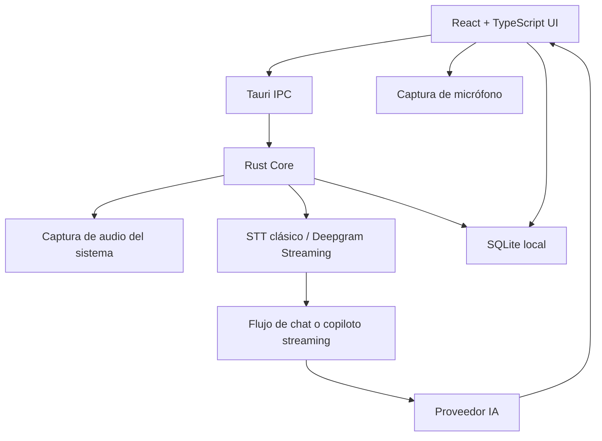

# InvisibleAI

<div align="center">
  <a href="https://invisibleai.com/">
    
  </a>
</div>

---

[](https://tauri.app/)
[](https://reactjs.org/)
[](https://www.rust-lang.org/)
[](LICENSE)
[](https://github.com/EDY28-M/invisibleai/releases)

> Proyecto en construcción. InvisibleAI es una app de escritorio multiplataforma para asistencia con IA en reuniones, entrevistas, clases, auditorías, videos y conversaciones en tiempo real.

## Descripción

InvisibleAI combina una interfaz flotante hecha en React/TypeScript con un núcleo Tauri/Rust para captura de audio, transcripción, proveedores de IA, persistencia local y publicación multiplataforma.

La aplicación permite trabajar en dos caminos separados:

- **Streaming**: captura en tiempo real con Deepgram Streaming, audio del sistema, micrófono y copiloto multicanal.
- **No-streaming**: captura clásica por segmentos, STT tradicional con proveedores como Groq Whisper, OpenAI, Deepgram clásico o proveedores personalizados.

## Novedades en v1.2.1

- **Deepgram Streaming real-time** para audio del sistema en modo Auto.
- **Multihilo streaming** con audio del sistema y micrófono en paralelo.
- **Copiloto multicanal para streaming**:
  - `[Sistema]` representa audio externo: reunión, llamada, entrevista, clase, video o live.
  - `[Tú]` representa la voz del usuario por micrófono.
  - El micrófono tiene prioridad cuando el usuario habla.
  - El contexto reciente del sistema ayuda a responder preguntas del usuario.
- **Modo inteligente para streaming**:
  - Checkbox opcional visible solo con proveedores streaming.
  - Detección local de preguntas, solicitudes, objeciones, debates, opiniones fuertes, propuestas y decisiones.
  - Evita responder a ruido, fillers o contexto narrativo sin intención clara.
- **Respuestas streaming sin cierres innecesarios**:
  - No termina con frases tipo "¿quieres que profundice?" o "¿te gustaría que...?".
  - Prioriza respuestas cortas, accionables y listas para decir.
- **Captura clásica no-streaming corregida**:
  - VAD local en Rust menos agresivo para audio del sistema.
  - El audio enviado al STT se conserva crudo/normalizado, sin destruirlo con noise gate.
  - Migración de presets antiguos de VAD para evitar configuraciones guardadas demasiado restrictivas.
  - Logs temporales `ClassicSystemAudio` para diagnosticar captura, Blob WAV, STT y envío al chat.
- **UI de streaming ajustada**:
  - En streaming se muestran Auto, Multihilo y Modo inteligente.
  - Manual se mantiene para proveedores no-streaming.
  - Iconografía actualizada con `iconoir-react` en la zona de controles.

## Modos de audio

### Streaming

Disponible cuando el proveedor STT activo es Deepgram Streaming y existe una API key válida.

- **Auto**: captura audio del sistema en tiempo real y usa el copiloto streaming.
- **Multihilo**: captura audio del sistema y micrófono en paralelo.
- **Modo inteligente**: mejora la detección de eventos accionables del audio del sistema.

El System Prompt del usuario se usa como preparación de contexto, por ejemplo: entrevista técnica, auditoría, reunión comercial, asesoría o debate. Las reglas internas de separación entre `[Sistema]` y `[Tú]` no dependen del prompt editable.

### No-streaming

Disponible para proveedores STT tradicionales.

- **Auto**: captura audio del sistema, segmenta por VAD local, transcribe y envía al chat.
- **Multihilo**: mantiene el flujo actual de sistema + micrófono.
- **Manual**: mantiene el comportamiento clásico sin cambios.

Este flujo no usa el copiloto streaming ni el Modo inteligente. Su objetivo es ser simple y estable: capturar audio, transcribirlo con el proveedor elegido y enviarlo al chat.

## Proveedores soportados

### IA / LLM

Configura tus propias API keys desde ajustes:

- OpenAI
- Anthropic Claude
- Google Gemini
- Proveedores compatibles con API personalizada
- Modelos locales vía Ollama o LM Studio

### STT

- Deepgram Streaming real-time
- Deepgram clásico
- Groq Whisper
- OpenAI Whisper / STT
- Proveedores STT personalizados

### TTS

- ElevenLabs
- OpenAI TTS
- Voces integradas de Windows/macOS cuando estén disponibles

## Arquitectura



## Configuración local

Requisitos:

- Node.js LTS
- Rust estable
- Dependencias nativas de Tauri según el sistema operativo

```bash
# Instalar dependencias
npm install

# Ejecutar frontend en desarrollo
npm run dev

# Ejecutar app Tauri en desarrollo
npm run tauri dev

# Build web
npm run build

# Build instaladores de escritorio
npm run tauri build
```

## Modelos locales

Para usar IA local:

1. Instala [Ollama](https://ollama.com/) o [LM Studio](https://lmstudio.ai/).
2. Descarga un modelo compatible, por ejemplo `llama3`, `mistral`, `phi3` o `qwen`.
3. Abre InvisibleAI y configura un proveedor local.
4. Usa una URL base como `http://localhost:11434` para Ollama o `http://localhost:1234` para LM Studio.

## Release y despliegue

La versión actual es **1.2.1**.

Los archivos que deben mantenerse sincronizados para release son:

- `package.json`
- `package-lock.json`
- `src-tauri/Cargo.toml`
- `src-tauri/Cargo.lock`
- `src-tauri/tauri.conf.json`

El workflow `.github/workflows/publish.yml` publica builds multiplataforma con `tauri-apps/tauri-action` al hacer push a `main`. El release usa el formato de tag:

```text
app-v__VERSION__
```

Para esta versión, GitHub Actions generará el release como:

```text
app-v1.2.1
```

## Estructura del proyecto

```text
InvisibleAI/
├── src/                    # Frontend React + TypeScript
│   ├── components/         # Componentes reutilizables
│   ├── contexts/           # Contextos globales
│   ├── hooks/              # Hooks de captura, audio y estado
│   ├── lib/                # Funciones de IA, STT, storage y copiloto
│   ├── screens/            # Pantallas principales de la app
│   └── types/              # Tipos TypeScript
├── src-tauri/              # Backend Rust + Tauri
│   ├── src/                # Comandos Rust, captura, STT, updater
│   ├── icons/              # Iconos para plataformas
│   ├── capabilities/       # Permisos Tauri
│   └── tauri.conf.json     # Configuración de Tauri
├── .github/workflows/      # GitHub Actions
├── logo/                   # Logotipos fuente
└── images/                 # Imágenes del README
```

## Licencia

Este proyecto utiliza una licencia comercial de código disponible.

- Puedes usar la versión gratuita según las condiciones del producto.
- Puedes leer y auditar el código fuente.
- Está prohibido modificar el código para saltarse licencias, redistribuir cracks o publicar clones que desbloqueen funciones premium.

Lee los términos completos en [LICENSE](LICENSE).
