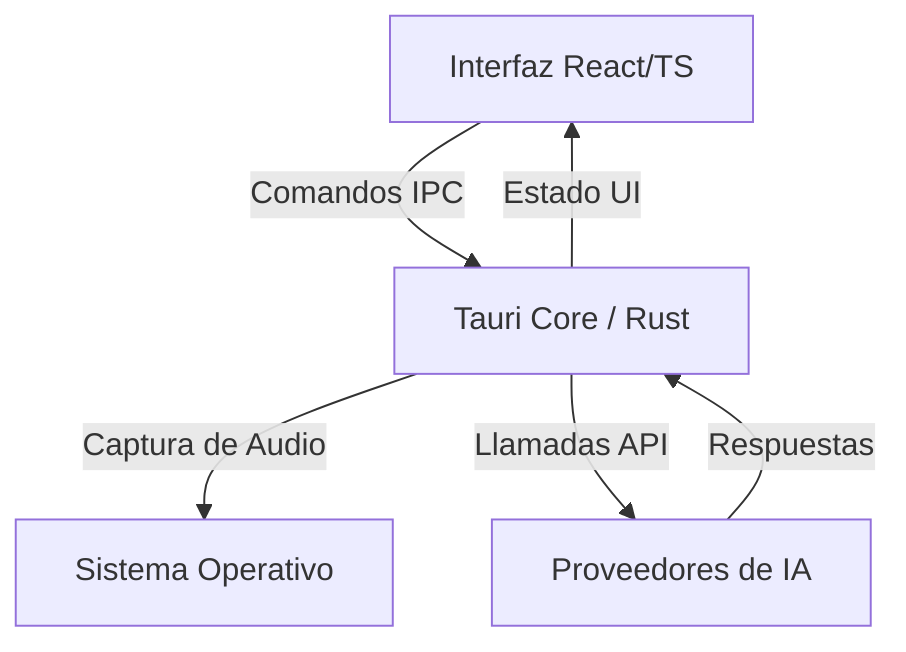

# InvisibleAI 🚀

<div align="center">
  <a href="https://invisibleai.com/">
    
  </a>
</div>

---

[](https://tauri.app/)
[](https://reactjs.org/)
[](LICENSE)
[](https://github.com/EDY28-M/InvisibleAI)

> ⚠️ **PROYECTO EN CONSTRUCCIÓN**

## 📖 Descripción General
InvisibleAI es una aplicación de escritorio multiplataforma rápida y privada para la interacción con modelos de IA. Esta herramienta te permite experimentar una asistencia en tiempo real con privacidad y control total.

## ✨ Características en v1.0.0

### 🎨 Diseño y UI
- **Nuevo logotipo personalizado** en la barra lateral y en el ícono de la aplicación (dock de macOS).
- **Tipografía premium** con Google Fonts (Inter) aplicada globalmente: `letter-spacing` ajustado, renderizado `antialiased` y `line-height` refinado.
- **Tema oscuro mejorado** con paleta de colores profundos (fondos casi negros, alto contraste).
- **Logotipo con fondo transparente** para una apariencia profesional en el dock de macOS.

### 🛡️ Modo Sigilo (Stealth Mode)
- **Nueva función premium**: Controla dinámicamente si la app es invisible en capturas de pantalla y grabaciones.
- Toggle integrado en **Ajustes → Comportamiento de Ventana**.
- Activado por defecto (la app es invisible en capturas).
- Los usuarios con licencia activa pueden desactivarlo para permitir capturas de pantalla.
- Funciona en tiempo real sin necesidad de reiniciar la app.

### 🌐 Internacionalización
- Soporte completo bilingüe (Español / English) para todas las nuevas funciones.
- Traducciones del Modo Sigilo en ambos idiomas.

### 🔧 Mejoras Técnicas
- Ajustes de ventana reorganizados: interfaz más limpia con toggles alineados al lado derecho.
- Identificador de paquete actualizado a `com.edy28.invisibleai`.
- Configuraciones de ventana optimizadas para macOS.

## 🏗️ Arquitectura del Sistema



## 🧠 Modelos Disponibles y Configuración

El sistema es flexible y soporta múltiples proveedores de nube, así como ejecución local para mayor privacidad.

### ☁️ Modelos en la Nube
Necesitarás añadir tus propias API Keys desde los ajustes internos:
*   **OpenAI:** (GPT-4o, GPT-3.5)
*   **Anthropic:** (Claude 3.5 Sonnet, Opus)
*   **Google Gemini:** (Gemini 1.5 Pro, Flash)

### 💻 Configuración de Modelos Locales (Paso a Paso)
Si prefieres máxima privacidad (sin necesidad de internet), sigue estos pasos:
1. **Instala [Ollama](https://ollama.com/) o [LM Studio](https://lmstudio.ai/)** en tu computadora.
2. **Descarga un modelo compatible**. Los más recomendados son: `llama3`, `mistral`, `phi3` o `qwen`.
   * *Ejemplo en Ollama:* Abre tu terminal y ejecuta `ollama run llama3`.
3. **Abre InvisibleAI** y dirígete a la pestaña de "Configuración de Modelos".
4. Selecciona **Proveedor Local**.
5. Ingresa la URL base de tu servidor local (ej. `http://localhost:11434` para Ollama o `http://localhost:1234` para LM Studio).
6. Guarda los cambios. ¡Listo! Todo el procesamiento ocurrirá en tu computadora.

## 🎙️ Configuración de Audio (STT y TTS)

InvisibleAI está diseñado para escucharte y hablarte sin necesidad de tocar el teclado:
*   **Reconocimiento de Voz (STT - Speech to Text):** Puedes configurarlo para transcribir tu voz al instante usando Whisper (OpenAI), Deepgram o reconocimiento del sistema. *Nota: Deberás aceptar los permisos de micrófono del sistema operativo en el primer uso.*
*   **Texto a Voz (TTS - Text to Speech):** Permite que la IA te responda con voz fluida y natural. Puedes usar ElevenLabs, OpenAI TTS, o las voces integradas de Windows/macOS.

## 💳 Suscripción y Limitaciones
Ten en cuenta que el acceso está estructurado mediante suscripción:
*   **Cuenta Gratuita:** Funcionalidades básicas y uso limitado a modelos estándar.
*   **Cuenta Premium:** Acceso total, máxima velocidad, modelos avanzados sin límite de cuota, y funciones exclusivas como el Modo Sigilo y personalización de tema.

## 🚀 Comandos para Levantar el Proyecto

Asegúrate de tener Node.js y Rust instalados.

```bash
# Instalar todas las dependencias
npm install

# Levantar la aplicación en modo de desarrollo
npm run tauri dev

# Compilar los ejecutables de producción
npm run tauri build

# Regenerar íconos de la app (requiere imagen PNG 1024x1024)
npm run tauri icon logo/stich_logo_transparent.png
```

## 📂 Estructura del Proyecto

```
InvisibleAI/
├── src/                    # Frontend (React + TypeScript)
│   ├── components/         # Componentes reutilizables (Header, Sidebar, Switch...)
│   ├── contexts/           # Contextos globales (App, Theme, Language)
│   ├── hooks/              # Custom hooks
│   ├── pages/              # Páginas de la app (Dashboard, Settings, Chats...)
│   ├── lib/                # Utilidades, storage, funciones de IA
│   └── types/              # Definiciones TypeScript
├── src-tauri/              # Backend (Rust + Tauri)
│   ├── src/                # Comandos Rust (window, capture, shortcuts...)
│   ├── icons/              # Íconos generados para todas las plataformas
│   └── tauri.conf.json     # Configuración de Tauri
├── logo/                   # Logotipos fuente
└── images/                 # Imágenes para el README
```

## 📄 Licencia / License

Este proyecto utiliza una **Licencia Comercial de Código Disponible (Source-Available)**. 
- Puedes usar la versión gratuita libremente.
- Puedes leer y auditar el código fuente.
- **ESTÁ ESTRICTAMENTE PROHIBIDO** modificar el código para saltarse el sistema de licencias, o redistribuir versiones modificadas (cracks/clones) que desbloqueen las funciones premium gratis.

Para ver los términos completos, lee el archivo [LICENSE](LICENSE) en este repositorio.
